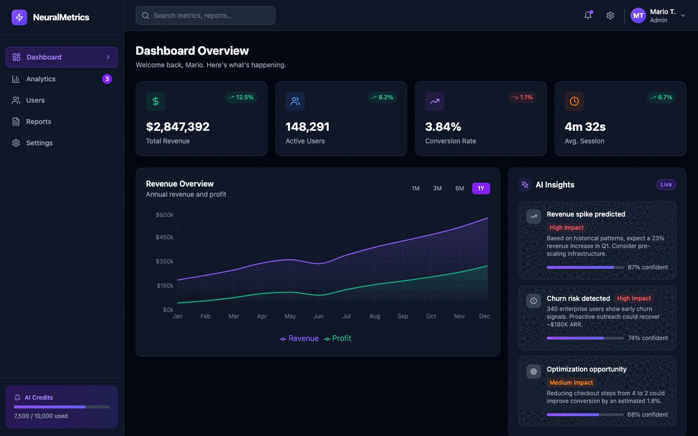

<div align="center">

# NeuralMetrics

**Your product's pulse — visualized.**

A production-grade AI analytics dashboard with live KPI metrics, revenue charts, ML-driven insights, and an activity feed — all wrapped in a polished dark UI.

[](https://react.dev)
[](https://www.typescriptlang.org)
[](https://tailwindcss.com)
[](https://vitejs.dev)



</div>

---

## What is NeuralMetrics?

An analytics dashboard template that looks like it cost a lot to build. KPI cards with trend indicators, interactive area and bar charts, an AI insights panel with confidence scores, and a live activity feed — all in a dark theme with violet/indigo gradient accents.

Built as a showcase of composable React 19 architecture using Recharts, Lucide icons, Tailwind CSS v4, and a clean **Atomic Design** layer structure from atoms to pages.

```bash
git clone https://github.com/mariotavarez/react-ai-dashboard.git
cd react-ai-dashboard && npm install && npm run dev
```

---

## Features

- **KPI Metric Cards** — Revenue, active users, conversion rate, and churn with trend badges and % change
- **Revenue Chart** — Interactive Recharts AreaChart with period selector (7D / 30D / 90D / 1Y)
- **User Growth Chart** — Recharts BarChart showing new vs. returning users over time
- **AI Insights Panel** — ML-driven recommendations with confidence scores and progress bars
- **Activity Feed** — Real-time stream of user events with avatars and action badges
- **Navigation Sidebar** — Fixed left sidebar with active section highlighting and AI credits widget
- **Responsive** — Adapts from mobile single column to ultra-wide multi-panel layouts

---

## Quick Start

```bash
git clone https://github.com/mariotavarez/react-ai-dashboard.git
cd react-ai-dashboard
npm install
npm run dev
```

Open [http://localhost:5173](http://localhost:5173)

---

## Structure — Atomic Design

```
src/
├── atoms/
│   ├── Avatar.tsx          # initials avatar with gradient background option
│   ├── Badge.tsx           # generic badge with status/color variants
│   ├── Button.tsx          # primary / ghost / period selector variants
│   ├── IconWrapper.tsx     # Lucide icon with colored circular background
│   ├── ProgressBar.tsx     # 0-100 animated progress bar
│   └── TrendBadge.tsx      # up/down percentage trend indicator
├── molecules/
│   ├── ActivityItem.tsx    # feed row combining Avatar + action text + Badge
│   ├── InsightCard.tsx     # AI insight with IconWrapper + Badge + ProgressBar
│   ├── MetricCard.tsx      # KPI card with IconWrapper + value + TrendBadge
│   ├── NavItem.tsx         # sidebar navigation button with active state
│   └── SearchInput.tsx     # search field with magnifier icon
├── organisms/
│   ├── ActivityFeed.tsx    # scrollable list of ActivityItems
│   ├── AiInsightsPanel.tsx # list of InsightCards with section header
│   ├── MetricGrid.tsx      # responsive 2x2 or 4x1 grid of MetricCards
│   ├── RevenueChart.tsx    # AreaChart with gradient fill + period buttons
│   ├── Sidebar.tsx         # full navigation sidebar with AI credits widget
│   ├── TopBar.tsx          # header with search, notifications, user avatar
│   └── UserGrowthChart.tsx # BarChart comparing new vs returning users
├── templates/
│   └── DashboardLayout.tsx # Sidebar + TopBar + scrollable main content
├── pages/
│   └── DashboardPage.tsx   # full page composition with section routing
└── data/mockData.ts        # KPI metrics, chart data, insights, activity feed
```

---

## Tech Stack

| Technology | Version | Purpose |
|---|---|---|
| React | 19 | UI framework |
| TypeScript | 5.7 | Strict type safety |
| Tailwind CSS | v4 | Vite plugin — zero config |
| Recharts | 2.10 | AreaChart and BarChart visualizations |
| Lucide React | 0.344 | Icon set |
| Vite | 6.2 | Build tool |

---

## License

MIT © [Mario Tavarez](https://github.com/mariotavarez)
